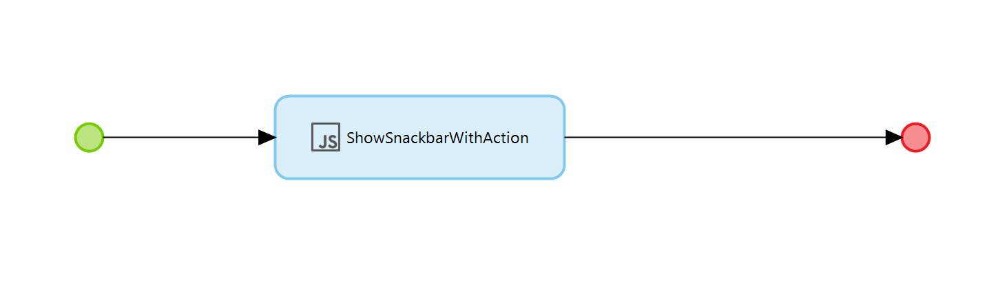
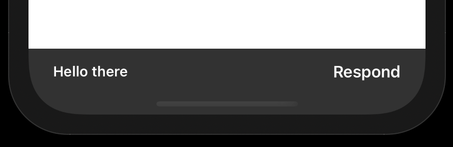

# Snackbar-Native

Implementation of https://www.npmjs.com/package/react-native-snackbar for Mendix Native

### Features

Show ephemeral, passive notifications in your Mendix native app

* Show message with text
* Show message with text and action
* Configure the duration of the snackbar message

### Installation

Follow instructions [here](https://www.npmjs.com/package/react-native-snackbar#installation) to install the Native package in your Native Project Directory

### Implementation

Use the included javascript actions in your nanoflows as needed

### TODO

- [ ] Expose JS actions as nanoflow activities